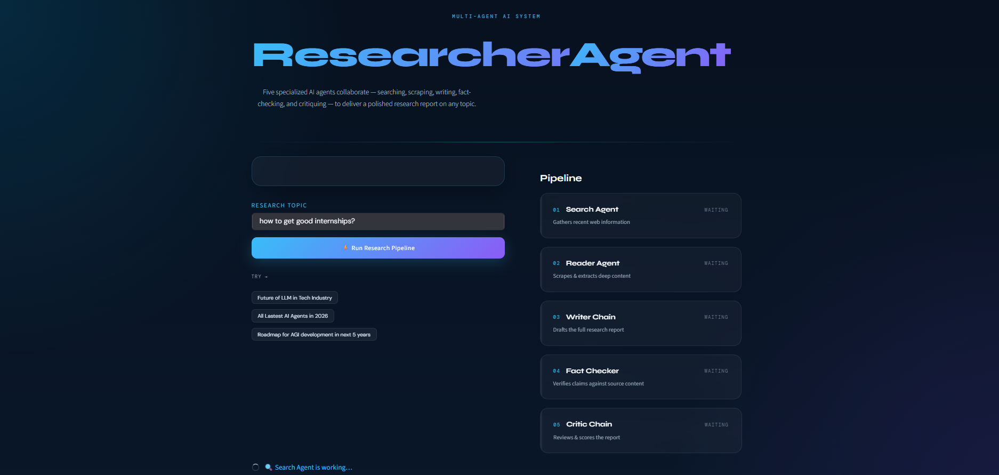
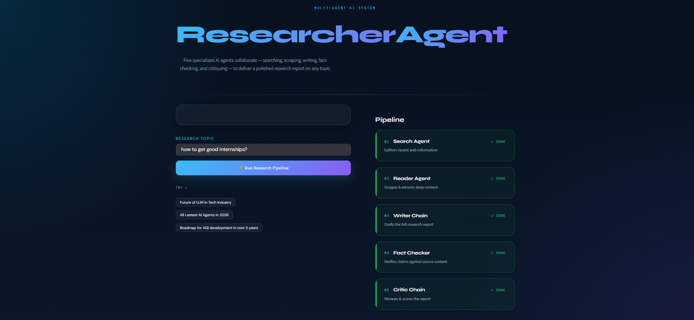
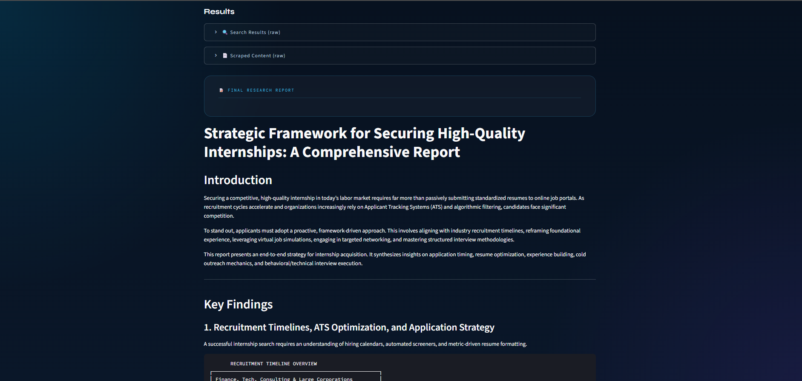
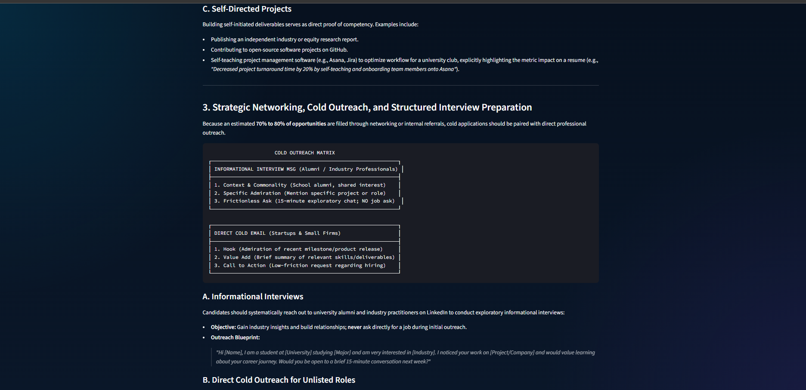
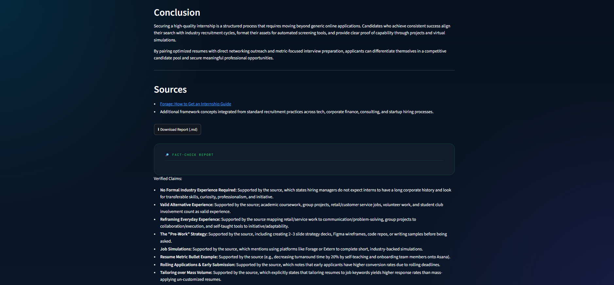

# Multi-Agent Research Assistant

A 5-agent AI pipeline that researches any topic end-to-end: searches the web, scrapes
the most relevant source, drafts a structured report, fact-checks it against the
source material, and critiques the final output — all shown live in a Streamlit UI.

**Live demo:** [multi-agent-research-g4ex.onrender.com](https://multi-agent-research-g4ex.onrender.com)

## Screenshots

**Landing page**


**Pipeline complete — all 5 agents done**


**Final research report**



**Conclusion, sources & fact-check verification**


## Pipeline

```
Search Agent → Reader Agent → Writer Chain → Fact-Checker Chain → Critic Chain
```

| Stage | Role |
|---|---|
| **Search Agent** | Uses Tavily to find recent, relevant web results on the topic |
| **Reader Agent** | Picks the most relevant URL and scrapes/extracts its full content |
| **Writer Chain** | Drafts a structured research report (Introduction, Key Findings, Conclusion, Sources) |
| **Fact-Checker Chain** | Cross-checks the report's claims against the scraped source content |
| **Critic Chain** | Scores and critiques the final report |

## Tech stack

- **LangChain / LangGraph** — agent orchestration
- **Gemini** (`gemini-3.6-flash`) — primary LLM, via `langchain-google-genai`
- **Grok** (`grok-4-fast`) — automatic fallback LLM if Gemini errors/rate-limits, via
  xAI's OpenAI-compatible endpoint (`langchain-openai` pointed at `api.x.ai/v1`)
- **Tavily** — web search API
- **trafilatura / readability-lxml / BeautifulSoup** — layered content extraction for scraping
- **Streamlit** — UI

## Setup

1. Clone the repo and create a virtual environment:
   ```bash
   git clone https://github.com/Anshv2406/multi-agent-research.git
   cd multi-agent-research
   python -m venv .venv
   .venv\Scripts\activate   # Windows
   # source .venv/bin/activate   # macOS/Linux
   ```

2. Install dependencies:
   ```bash
   pip install -r requirements.txt
   ```

3. Create a `.env` file in the project root with your API keys:
   ```
   GOOGLE_API_KEY=your_gemini_key
   XAI_API_KEY=your_grok_key
   TAVILY_API_KEY=your_tavily_key
   ```

4. Run the app:
   ```bash
   streamlit run app.py
   ```

## Deployment

Deployed on [Render](https://render.com) as a Web Service:

- **Build Command:** `pip install -r requirements.txt`
- **Start Command:** `streamlit run app.py --server.port $PORT --server.address 0.0.0.0`
- **Environment Variables:** `GOOGLE_API_KEY`, `XAI_API_KEY`, `TAVILY_API_KEY` (set in the
  Render dashboard, never committed to the repo)

## Known limitations

See [LIMITATIONS.md](./LIMITATIONS.md) for a full breakdown of where and why this
pipeline can fail in real-world use — model deprecation, rate limits, scraping
fragility, hallucination risk, and deployment cold-starts — and which of those are
already mitigated.
